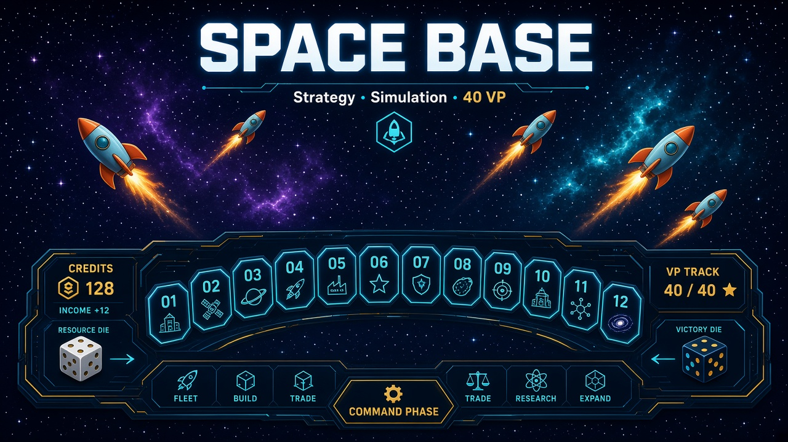

<p align="center">
  
</p>

<p align="center">
  <a href="https://pkfamily.github.io/space-base-strategy/"></a>
  <a href="docs/simulator.md"></a>
  <a href="tests/"></a>
</p>

<p align="center">
  Unofficial fan project — table guides for 2p–5p Space Base, plus a <strong>2-player simulation package</strong> you can run from the CLI.
</p>

---

## `spacebase2p` — 2-player simulation

We built a **Python package** (`src/spacebase2p`) that plays out head-to-head Space Base games: dice allocation, doubles, income floor, colonies, rockets, arrows, and “spend all gold” buys. Ship it with three bots — **`income`**, **`rush`**, **`random`** — and batch thousands of games for win rates, overspend, and when colonies hit.

```bash
git clone https://github.com/pkfamily/space-base-strategy.git
cd space-base-strategy
pip install -e ".[dev]"

python3 -m spacebase2p.cli -n 500 --p0 income --p1 rush --seed 42
python3 -m pytest
```

| | |
| --- | --- |
| Package reference | [docs/simulator.md](docs/simulator.md) |
| Matchup tables & analysis | [Simulation results](https://pkfamily.github.io/space-base-strategy/simulation.html) · [markdown](docs/simulation.md) |
| Console entry point | `spacebase2p` after `pip install -e .` |

Early sim takeaway: **rush-style bots crush income bots** in the current heuristics — mostly **overspend** on always-buy income, not because income is useless. Details on the [results page](docs/simulation.md).

---

## Strategy guides

Full playbooks (engine math, 2p/3p normal, Light Speed, tactics) are on **GitHub Pages**:

### [pkfamily.github.io/space-base-strategy](https://pkfamily.github.io/space-base-strategy/)

- [Engine rules](https://pkfamily.github.io/space-base-strategy/engine.html) · [2p](https://pkfamily.github.io/space-base-strategy/guide/2p-normal.html) · [3p](https://pkfamily.github.io/space-base-strategy/guide/3p-normal.html) · [Light Speed](https://pkfamily.github.io/space-base-strategy/guide/light-speed.html) · [Quick reference](https://pkfamily.github.io/space-base-strategy/guide/quick-reference.html)

Source: [`docs/`](docs/)

---

## Repo layout

```
src/spacebase2p/   simulation engine, bots, CLI
tests/             core rules covered by pytest
docs/              site + guides + assets/
```

<details>
<summary><strong>Maintainers: GitHub Pages</strong></summary>

Build from **`docs/`** (not repo root). **Settings → Pages → GitHub Actions** ([workflow](.github/workflows/pages.yml)), or deploy branch `main` → `/docs`.

</details>

<p align="center">
  <sub>Space Base™ is © Alderac Entertainment Group. This repository is unofficial fan content.</sub>
</p>
